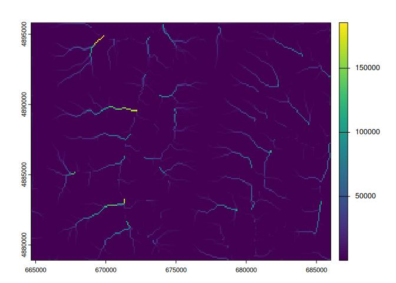

# whitebox

<!-- badges: start -->

<!-- badges: end -->

**WhiteboxTools** R Frontend.

This repository is related to the **whitebox** R package for geospatial
analysis, which is an R frontend of a stand-alone executable
command-line program called
**[WhiteboxTools](https://github.com/jblindsay/whitebox-tools)**.

-   Authors: John Lindsay
    (<https://jblindsay.github.io/ghrg/index.html>)
-   Contributors:
    -   Qiusheng Wu (<https://wetlands.io>)
    -   Andrew G. Brown (<https://humus.rocks>)
-   GitHub repo: <https://github.com/opengeos/whiteboxR>
-   CRAN link: <https://cran.r-project.org/package=whitebox>
-   WhiteboxTools: <https://github.com/jblindsay/whitebox-tools>
-   User Manual: <https://jblindsay.github.io/wbt_book/>
-   Free software: [MIT license](https://opensource.org/license/MIT)

**Contents**

1.  [Description](#description)
2.  [Installation](#installation)
3.  [Usage](#usage)
4.  [Available Tools](#available-tools)
5.  [Contributing](#contributing)
6.  [License](#license)
7.  [Reporting Bugs](#reporting-bugs)

## Description

The **whitebox** R package is built on **WhiteboxTools**, an advanced
geospatial data analysis platform developed by Prof. John Lindsay
([webpage](https://jblindsay.github.io/ghrg/index.html);
[jblindsay](https://github.com/jblindsay)) at the University of Guelph’s
[Geomorphometry and Hydrogeomatics Research
Group](https://jblindsay.github.io/ghrg/index.html). *WhiteboxTools* can
be used to perform common geographical information systems (GIS)
analysis operations, such as cost-distance analysis, distance buffering,
and raster reclassification. Remote sensing and image processing tasks
include image enhancement (e.g. panchromatic sharpening, contrast
adjustments), image mosaicing, numerous filtering operations, simple
classification (k-means), and common image transformations.
*WhiteboxTools* also contains advanced tooling for spatial hydrological
analysis (e.g. flow-accumulation, watershed delineation, stream network
analysis, sink removal), terrain analysis (e.g. common terrain indices
such as slope, curvatures, wetness index, hillshading; hypsometric
analysis; multi-scale topographic position analysis), and LiDAR data
processing. LiDAR point clouds can be interrogated (LidarInfo,
LidarHistogram), segmented, tiled and joined, analyzed for outliers,
interpolated to rasters (DEMs, intensity images), and ground-points can
be classified or filtered. *WhiteboxTools* is not a cartographic or
spatial data visualization package; instead it is meant to serve as an
analytical backend for other data visualization software, mainly GIS.
Suggested citation: Lindsay, J. B. (2016). Whitebox GAT: A case study in
geomorphometric analysis. *Computers & Geosciences*, 95, 75-84. doi:
<http://dx.doi.org/10.1016/j.cageo.2016.07.003>

## Installation

There are three ways to install the **whitebox** R package.

### 1. CRAN

**whitebox** is now available on
[CRAN](https://cran.r-project.org/package=whitebox), so you can install
it with:

    install.packages("whitebox")

### 2. GitHub

You can alternatively install the development version of **whitebox**
from [GitHub](https://github.com/opengeos/whiteboxR) as follows:

    if (!require("remotes")) install.packages('remotes')
    remotes::install_github("opengeos/whiteboxR", build = FALSE)

## Usage

The function `wbt_init()` checks the path to the ‘WhiteboxTools’ binary.

    wbt_init()

It (invisibly) returns a logical (TRUE/FALSE) value reflecting whether a
file is found at one of the default paths, including those specified by
package options. See `?whitebox::whitebox`.

If you have ‘WhiteboxTools’ installed already but in a non-standard
location run `wbt_init(exe_path=...)` to set up your options for your
current R session.

    wbt_init(exe_path = 'C:/home/user/path/to/whitebox_tools.exe')

Additional arguments to `wbt_init()` can set other package options, such
as whether tools print their standard console output with `cat()`.

If you want to turn this off, set `verbose = FALSE`, for instance:

    wbt_init(exe_path = 'C:/home/user/path/to/whitebox_tools.exe', verbose = FALSE)

## Documentation

For whitebox package documentation in R, ask for help:

    ??whitebox

For list of functions, try the `wbt_` prefix in your search:

    ??wbt_

A complete list of functions available in the **whitebox** R package can
be found [HERE](https://whiteboxR.gishub.org/reference/index.html).

Check out this [demo](https://whiteboxR.gishub.org/articles/demo.html)
for examples.

## Installing ‘WhiteboxTools’

The quickest way to get started if you are on 64-bit Windows, Linux or
MacOS architectures is to download and install the ‘WhiteboxTools’
binary. Linux binaries compiled with ‘musl’ instead of ‘glibc’ on Ubuntu
22.04 are available with `platform="linux_musl"`. On MacOS, Intel and
Apple ‘M’ series processors (‘arm64’) are supported.

A method `install_whitebox()` is provided to download a version of the
binaries that corresponds to the wrapper functions available in the
package.

    whitebox::install_whitebox()

By default this will install ‘WhiteboxTools’ to your whitebox R package
data directory (see `wbt_data_dir()`), subdirectory “WBT”.

## whitebox

**How do I run tools?**

Tool names in the whitebox R package can be called by corresponding
function using `wbt_snake_case()` naming convention
(e.g. `wbt_lidar_info()` R function for `"LidarInfo"` ‘WhiteboxTools’
tool name).

First we load the library and perform any necessary setup.

    library(whitebox)

    # set up as needed
    wbt_init()

Many ‘WhiteboxTools’ will take GeoTIFF files as input, but
‘WhiteboxTools’ supports several grid input formats. There is a sample
Digital Elevation Model (DEM) included in the whitebox package. You can
get path as follows for this demo:

    # Set input raster DEM file
    dem <- sample_dem_data()

We will use this DEM in a sequence of ‘WhiteboxTools’ processing
routines. Run tools by passing file paths for the input and output
files.

1.  Apply feature-preserving smoothing (*FeaturePreservingSmoothing*)

2.  Breach depressions in a DEM (*BreachDepressions*)

3.  Calculate D-Infinity flow accumulation (*DInfFlowAccumulation*)

The `filter` argument to `wbt_feature_preserving_smoothing()` sets the
size of the filter kernel.

    ## 1. FeaturePreservingSmoothing
    wbt_feature_preserving_smoothing(
      dem = dem,
      output = "./smoothed.tif",
      filter = 9
    )

    ## 2. BreachDepressions
    wbt_breach_depressions(dem = "./smoothed.tif", output = "./breached.tif")

    ## 3. DInfFlowAccumulation
    wbt_d_inf_flow_accumulation(input = dem, output = "./flow_accum.tif")

    if (requireNamespace('terra')) {
      terra::plot(terra::rast("./flow_accum.tif"))
    }
    #> Loading required namespace: terra

**About ‘WhiteboxTools’**

    library(whitebox)

    # cat() output in non-interactive mode
    wbt_verbose(TRUE)

    # Prints the whitebox-tools help...a listing of available commands
    wbt_help()
    #> WhiteboxTools Help
    #> 
    #> The following commands are recognized:
    #> --cd, --wd          Changes the working directory; used in conjunction with --run flag.
    #> --compress_rasters  Sets the compress_raster option in the settings.json file; determines if newly created rasters are compressed. e.g. --compress_rasters=true
    #> -h, --help          Prints help information.
    #> -l, --license       Prints the whitebox-tools license. Tool names may also be used, --license="Slope"
    #> --listtools         Lists all available tools. Keywords may also be used, --listtools slope.
    #> --max_procs         Sets the maximum number of processors used. -1 = all available processors. e.g. --max_procs=2
    #> -r, --run           Runs a tool; used in conjunction with --wd flag; -r="LidarInfo".
    #> --toolbox           Prints the toolbox associated with a tool; --toolbox=Slope.
    #> --toolhelp          Prints the help associated with a tool; --toolhelp="LidarInfo".
    #> --toolparameters    Prints the parameters (in json form) for a specific tool; --toolparameters="LidarInfo".
    #> -v                  Verbose mode. Without this flag, tool outputs will not be printed.
    #> --viewcode          Opens the source code of a tool in a web browser; --viewcode="LidarInfo".
    #> --version           Prints the version information.
    #> 
    #> Example Usage:
    #> >> ./whitebox_tools -r=lidar_info --cd="/path/to/data/" -i=input.las --vlr --geokeys

    # Prints the whitebox-tools license
    wbt_license()
    #> WhiteboxTools License
    #> Copyright 2017-2023 John Lindsay
    #> 
    #> Permission is hereby granted, free of charge, to any person obtaining a copy of this software and
    #> associated documentation files (the "Software"), to deal in the Software without restriction,
    #> including without limitation the rights to use, copy, modify, merge, publish, distribute, sublicense,
    #> and/or sell copies of the Software, and to permit persons to whom the Software is furnished to do so,
    #> subject to the following conditions:
    #> 
    #> The above copyright notice and this permission notice shall be included in all copies or substantial
    #> portions of the Software.
    #> 
    #> THE SOFTWARE IS PROVIDED "AS IS", WITHOUT WARRANTY OF ANY KIND, EXPRESS OR IMPLIED, INCLUDING BUT
    #> NOT LIMITED TO THE WARRANTIES OF MERCHANTABILITY, FITNESS FOR A PARTICULAR PURPOSE AND
    #> NONINFRINGEMENT. IN NO EVENT SHALL THE AUTHORS OR COPYRIGHT HOLDERS BE LIABLE FOR ANY CLAIM, DAMAGES
    #> OR OTHER LIABILITY, WHETHER IN AN ACTION OF CONTRACT, TORT OR OTHERWISE, ARISING FROM, OUT OF OR IN
    #> CONNECTION WITH THE SOFTWARE OR THE USE OR OTHER DEALINGS IN THE SOFTWARE.

    # Prints the whitebox-tools version
    wbt_version()
    #> WhiteboxTools v2.4.0 (c) Dr. John Lindsay 2017-2023
    #> 
    #> WhiteboxTools is an advanced geospatial data analysis platform developed at
    #> the University of Guelph's Geomorphometry and Hydrogeomatics Research 
    #> Group (GHRG). See www.whiteboxgeo.com for more details.

    # Prints the toolbox for a specific tool.
    wbt_toolbox("AsciiToLas")
    #> LiDAR Tools

    # Lists tools with 'lidar' in tool name or description.
    wbt_list_tools("lidar")
    #> All 66 Tools containing keywords:
    #> AsciiToLas: Converts one or more ASCII files containing LiDAR points into LAS files.
    #> ClassifyBuildingsInLidar: Reclassifies a LiDAR points that lie within vector building footprints.
    #> ClassifyOverlapPoints: Classifies or filters LAS points in regions of overlapping flight lines.
    #> ClipLidarToPolygon: Clips a LiDAR point cloud to a vector polygon or polygons.
    #> ErasePolygonFromLidar: Erases (cuts out) a vector polygon or polygons from a LiDAR point cloud.
    #> FilterLidarClasses: Removes points in a LAS file with certain specified class values.
    #> FilterLidarScanAngles: Removes points in a LAS file with scan angles greater than a threshold.
    #> FindFlightlineEdgePoints: Identifies points along a flightline's edge in a LAS file.
    #> FlightlineOverlap: Reads a LiDAR (LAS) point file and outputs a raster containing the number of overlapping flight-lines in each grid cell.
    #> HeightAboveGround: Normalizes a LiDAR point cloud, providing the height above the nearest ground-classified point.
    #> LasToAscii: Converts one or more LAS files into ASCII text files.
    #> LasToMultipointShapefile: Converts one or more LAS files into MultipointZ vector Shapefiles. When the input parameter is not specified, the tool grids all LAS files contained within the working directory.
    #> LasToShapefile: Converts one or more LAS files into a vector Shapefile of POINT ShapeType.
    #> LasToZlidar: Converts one or more LAS files into the zlidar compressed LiDAR data format.
    #> LidarBlockMaximum: Creates a block-maximum raster from an input LAS file. When the input/output parameters are not specified, the tool grids all LAS files contained within the working directory.
    #> LidarBlockMinimum: Creates a block-minimum raster from an input LAS file. When the input/output parameters are not specified, the tool grids all LAS files contained within the working directory.
    #> LidarClassifySubset: Classifies the values in one LiDAR point cloud that correspond with points in a subset cloud.
    #> LidarColourize: Adds the red-green-blue colour fields of a LiDAR (LAS) file based on an input image.
    #> LidarDigitalSurfaceModel: Creates a top-surface digital surface model (DSM) from a LiDAR point cloud.
    #> LidarElevationSlice: Outputs all of the points within a LiDAR (LAS) point file that lie between a specified elevation range.
    #> LidarGroundPointFilter: Identifies ground points within LiDAR dataset using a slope-based method.
    #> LidarHexBinning: Hex-bins a set of LiDAR points.
    #> LidarHillshade: Calculates a hillshade value for points within a LAS file and stores these data in the RGB field.
    #> LidarHistogram: Creates a histogram of LiDAR data.
    #> LidarIdwInterpolation: Interpolates LAS files using an inverse-distance weighted (IDW) scheme. When the input/output parameters are not specified, the tool interpolates all LAS files contained within the working directory.
    #> LidarInfo: Prints information about a LiDAR (LAS) dataset, including header, point return frequency, and classification data and information about the variable length records (VLRs) and geokeys.
    #> LidarJoin: Joins multiple LiDAR (LAS) files into a single LAS file.
    #> LidarKappaIndex: Performs a kappa index of agreement (KIA) analysis on the classifications of two LAS files.
    #> LidarNearestNeighbourGridding: Grids LiDAR files using nearest-neighbour scheme. When the input/output parameters are not specified, the tool grids all LAS files contained within the working directory.
    #> LidarPointDensity: Calculates the spatial pattern of point density for a LiDAR data set. When the input/output parameters are not specified, the tool grids all LAS files contained within the working directory.
    #> LidarPointStats: Creates several rasters summarizing the distribution of LAS point data. When the input/output parameters are not specified, the tool works on all LAS files contained within the working directory.
    #> LidarRansacPlanes: Performs a RANSAC analysis to identify points within a LiDAR point cloud that belong to linear planes.
    #> LidarRbfInterpolation: Interpolates LAS files using a radial basis function (RBF) scheme. When the input/output parameters are not specified, the tool interpolates all LAS files contained within the working directory.
    #> LidarRemoveDuplicates: Removes duplicate points from a LiDAR data set.
    #> LidarRemoveOutliers: Removes outliers (high and low points) in a LiDAR point cloud.
    #> LidarRooftopAnalysis: Identifies roof segments in a LiDAR point cloud.
    #> LidarSegmentation: Segments a LiDAR point cloud based on differences in the orientation of fitted planar surfaces and point proximity.
    #> LidarSegmentationBasedFilter: Identifies ground points within LiDAR point clouds using a segmentation based approach.
    #> LidarTINGridding: Creates a raster grid based on a Delaunay triangular irregular network (TIN) fitted to LiDAR points.
    #> LidarThin: Thins a LiDAR point cloud, reducing point density.
    #> LidarThinHighDensity: Thins points from high density areas within a LiDAR point cloud.
    #> LidarTile: Tiles a LiDAR LAS file into multiple LAS files.
    #> LidarTileFootprint: Creates a vector polygon of the convex hull of a LiDAR point cloud. When the input/output parameters are not specified, the tool works with all LAS files contained within the working directory.
    #> LidarTophatTransform: Performs a white top-hat transform on a Lidar dataset; as an estimate of height above ground, this is useful for modelling the vegetation canopy.
    #> NormalVectors: Calculates normal vectors for points within a LAS file and stores these data (XYZ vector components) in the RGB field.
    #> SelectTilesByPolygon: Copies LiDAR tiles overlapping with a polygon into an output directory.
    #> ZlidarToLas: Converts one or more zlidar files into the LAS data format.
    #> ModifyLidar: Modify points within a LiDAR point cloud based on point properties.
    #> ColourizeBasedOnPointReturns: Sets the RGB values of a LiDAR point cloud based on the point returns.
    #> FilterLidarByReferenceSurface: Filters points within a LiDAR point cloud based on a reference surface.
    #> SmoothVegetationResidual: This tool can smooth the residual roughness due to vegetation cover in LiDAR DEMs.
    #> SortLidar: Sorts LiDAR points based on their properties.
    #> IndividualTreeDetection: Identifies points in a LiDAR point cloud that are associated with the tops of individual trees.
    #> SplitLidar: Splits LiDAR points up into a series of new files based on their properties.
    #> RecoverFlightlineInfo: Associates LiDAR points by their flightlines.
    #> ColourizeBasedOnClass: Sets the RGB values of a LiDAR point cloud based on the point classification values.
    #> LidarPointReturnAnalysis: This tool performs a quality control check on the return values of points in a LiDAR file.
    #> LidarShift: Shifts the x,y,z coordinates of a LiDAR file.
    #> FilterLidarByPercentile: Filters points within a LiDAR point cloud based on local elevation percentile.
    #> LidarContour: This tool creates a vector contour coverage from an input LiDAR point file.
    #> ImprovedGroundPointFilter: Filters points within a LiDAR point cloud based on a reference surface.
    #> LidarSibsonInterpolation: This tool interpolates one or more LiDAR tiles using Sibson's natural neighbour method.
    #> ClassifyLidar: Classify points within a LiDAR point cloud based on point properties.
    #> LidarEigenvalueFeatures: Calculate eigenvalue-based metrics from a LiDAR point cloud.
    #> FilterLidar: Filters points within a LiDAR point cloud based on point properties.
    #> NormalizeLidar: Normalizes a LiDAR point cloud.

    # Prints the help for a specific tool.
    wbt_tool_help("lidar_info")
    #> LidarInfo
    #> Description:
    #> Prints information about a LiDAR (LAS) dataset, including header, point return frequency, and classification data and information about the variable length records (VLRs) and geokeys.
    #> Toolbox: LiDAR Tools
    #> Parameters:
    #> 
    #> Flag               Description
    #> -----------------  -----------
    #> -i, --input        Input LiDAR file.
    #> -o, --output       Output HTML file for summary report.
    #> --density          Flag indicating whether or not to calculate the average point density and nominal point spacing.
    #> --vlr              Flag indicating whether or not to print the variable length records (VLRs).
    #> --geokeys          Flag indicating whether or not to print the geokeys.
    #> 
    #> 
    #> Example usage:
    #> >>./whitebox_tools -r=LidarInfo -v --wd="/path/to/data/" -i=file.las --vlr --geokeys"
    #> ./whitebox_tools -r=LidarInfo --wd="/path/to/data/" -i=file.las

    # Retrieves the tool parameter descriptions for a specific tool.
    wbt_tool_parameters("slope")
    #> {"parameters": [{"name":"Input DEM File","flags":["-i","--dem"],"description":"Input raster DEM file.","parameter_type":{"ExistingFile":"Raster"},"default_value":null,"optional":false},{"name":"Output File","flags":["-o","--output"],"description":"Output raster file.","parameter_type":{"NewFile":"Raster"},"default_value":null,"optional":false},{"name":"Z Conversion Factor","flags":["--zfactor"],"description":"Optional multiplier for when the vertical and horizontal units are not the same.","parameter_type":"Float","default_value":null,"optional":true},{"name":"Units","flags":["--units"],"description":"Units of output raster; options include 'degrees', 'radians', 'percent'","parameter_type":{"OptionList":["degrees","radians","percent"]},"default_value":"degrees","optional":true}]}

    # View the source code for a specific tool on the source code repository.
    wbt_view_code("breach_depressions")
    #> https://github.com/jblindsay/whitebox-tools/blob/master/whitebox-tools-app/src/tools/hydro_analysis/breach_depressions.rs

## Available Tools

The **[WhiteboxTools](https://github.com/jblindsay/whitebox-tools)**
library currently contains more than **537** tools, which are each
grouped based on their main function into one of the following
categories: Data Tools, GIS Analysis, Hydrological Analysis, Image
Analysis, LiDAR Analysis, Mathematical and Statistical Analysis, Stream
Network Analysis, and Terrain Analysis. For a listing of available
tools, complete with documentation and usage details, please see the
[‘WhiteboxTools’ User
Manual](https://jblindsay.github.io/wbt_book/available_tools/index.html).

If you are interested in using the ‘WhiteboxTools’ command-line program,
check [‘WhiteboxTools’
Usage](https://github.com/jblindsay/whitebox-tools#3-usage)

## Contributing

If you would like to contribute to the project as a developer, follow
these instructions to get started:

1.  Fork the whiteboxR repository
    (<https://github.com/opengeos/whiteboxR>)
2.  Create your feature branch (git checkout -b my-new-feature)
3.  Commit your changes (git commit -am ‘Add some feature’)
4.  Push to the branch (git push origin my-new-feature)
5.  Create a new Pull Request

Unless explicitly stated otherwise, any contribution intentionally
submitted for inclusion in the work shall be licensed as the [MIT
license](https://opensource.org/license/MIT) without any additional
terms or conditions.

## License

The whitebox **R** package is distributed under the [MIT
license](https://opensource.org/license/MIT), a permissive open-source
(free software) license.

## Reporting Bugs

whitebox is distributed as is and without warranty of suitability for
application. If you encounter flaws with the software (i.e. bugs) please
report the issue. Providing a detailed description of the conditions
under which the bug occurred will help to identify the bug. *Use the
[Issues tracker](https://github.com/opengeos/whiteboxR/issues) on GitHub
to report issues with the software and to request feature
enchancements.* Please do not email Dr. Lindsay directly with bugs.
